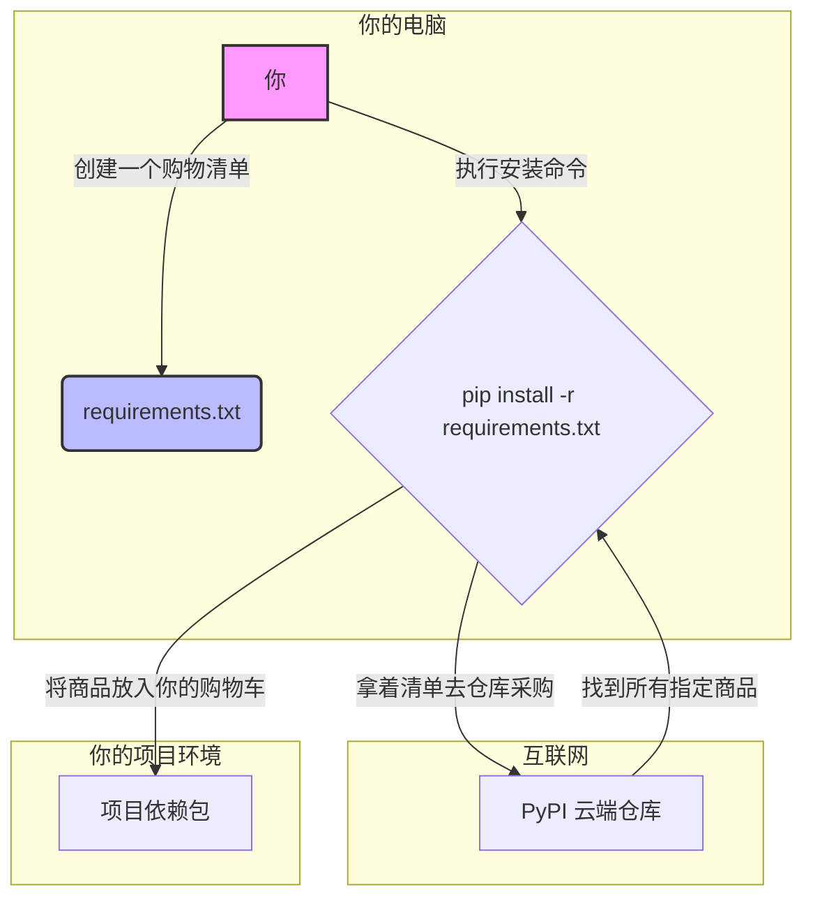

---
tags:
  - python
  - pip
  - 工具
alias: pip,python包管理工具
date: 2025-08-30 07:53
---
# 核心概念：pip - Python 包管理器

- **来源**：Python 官方生态系统，事实上的标准包管理工具
    
- **日期**：2025-08-30
    

### 关键论点

1. **定义**：`pip` 是 “Pip Installs Packages” 的递归缩写，是 Python 的官方包安装程序，用于从 Python 包索引 (PyPI - Python Package Index) 安装和管理软件包。
    
2. **核心功能**：其核心价值在于自动化地处理“依赖关系”。当你安装一个包（例如 `pandas`）时，`pip` 会自动为你安装 `pandas` 运行所需要的所有其他包（例如 `numpy`）。
    
3. **环境可复现性**：通过 `requirements.txt` 文件，`pip` 能够精确记录并复现一个项目所依赖的所有包及其版本，这是保证协作开发和服务器部署一致性的基石。
    

### 我的转述 (In My Own Words)

简单说，`pip` 就是 Python 世界的“App Store 管家”。

- **PyPI** 是那个巨大无比的 App Store，里面有成千上万个叫“包”的程序（比如数据分析工具 `pandas`，网站框架 `Django`）。
    
- **`pip`** 就是你手机上的 `App Store` 应用本身。你想装什么，就告诉 `pip` (`pip install ...`)；想删什么，也告诉它 (`pip uninstall ...`)；想看看你都装了啥，它也能给你列个清单 (`pip list`)。
    
- **`requirements.txt`** 就像是你的“App 愿望单”。你把项目需要的所有 App 和指定版本写在上面，然后把这张单子交给任何一台新电脑，用 `pip install -r requirements.txt` 命令，`pip` 就能像个任劳任怨的助理，把单子上所有的 App 一模一样地给你装好。这就解决了程序员最头疼的“在我电脑上明明能跑”的世纪难题。
    

### 联想与连接

- **向后看 (Backward Connection)**：这和前端开发里的 `npm` (Node.js) 或者 `yarn`，Java 世界的 `Maven` 或 `Gradle`，甚至 Linux 系统的 `apt` 或 `yum` 扮演着完全相同的角色。它们都是各自生态系统的“后勤部长”，负责管理代码依赖这个最繁琐但最重要的问题。
    
- **向前看 (Forward Connection)**：熟练使用 `pip` 是通往更高级环境管理工具（如 `virtualenv`, `conda`, `Poetry`）的必经之路。如果说 `pip` 是给你提供了所有食材的管家，那么 `virtualenv` 就是为你的每个项目都创建一个独立的、干净的厨房。这样，你给“川菜”项目准备的辣椒，就不会和“甜点”项目里的糖混在一起，从而解决了不同项目间包版本冲突的问题。
    

### 疑问？

- 如果项目 A 需要 `requests` 的 2.0 版本，而项目 B 需要 `requests` 的 3.0 版本，`pip` 在全局环境下会怎么办？ -> 这直接引出了为什么需要 `virtualenv` 这类虚拟环境工具的核心原因：为了隔离依赖。
    
- `pip install Pkg` 和 `python -m pip install Pkg` 有什么微妙的区别？为什么后者被认为是更稳妥的实践？ -> 后者能确保你使用的是当前 `python` 解释器对应的那个 `pip`，避免在多 Python 版本共存的系统里装错地方。
    

### 示意图/比喻 (Mermaid & Analogy)

**比喻**：`pip` 是一个神通广大的乐高采购员。`PyPI` 是全球最大的乐高零件仓库。当你要搭建一个复杂的“千年隼号”模型（你的项目）时，你不需要自己去一个个找零件，只需要把官方的零件清单 (`requirements.txt`) 交给采购员 `pip`。他会以最快的速度，不多不少、不偏不倚地把所有正确的零件（依赖包）给你找来，让你能顺利开工。

### 一句话总结

`pip` 是一个命令行工具，它让 Python 开发者能轻松地从一个中央仓库获取、安装和管理项目所需的代码库，并确保任何人在任何地方都能复刻出完全一致的开发环境。