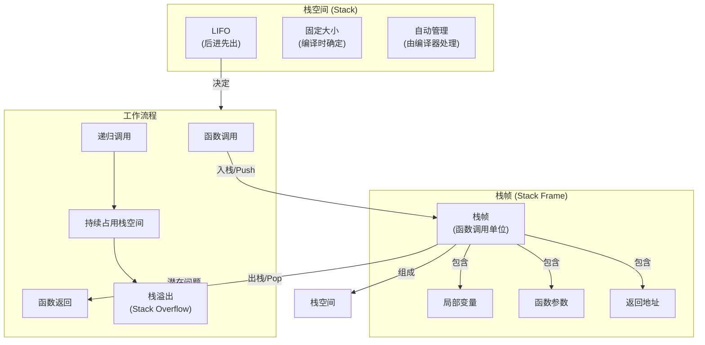

---
# 如何定义 Rust 结构体

tags:
  - rust
alias:
date: 2025-08-26 10:26
---

```mermaid
graph TD
    subgraph "栈空间 (Stack)"
        direction LR
        LIFO["LIFO<br>(后进先出)"]
        FixedSize["固定大小<br>(编译时确定)"]
        AutoManaged["自动管理<br>(由编译器处理)"]
    end

    subgraph "栈帧 (Stack Frame)"
        direction TD
        Frame["栈帧<br>(函数调用单位)"]
        Frame -- 包含 --> LocalVars["局部变量"]
        Frame -- 包含 --> FuncParams["函数参数"]
        Frame -- 包含 --> ReturnAddr["返回地址"]
    end

    subgraph "工作流程"
        Call["函数调用"] -- 入栈/Push --> Frame
        Frame -- 出栈/Pop --> Return["函数返回"]
        Recurse["递归调用"] --> StackUsage["持续占用栈空间"]
        StackUsage --> Overflow["栈溢出<br>(Stack Overflow)"]
    end

    LIFO -- 决定 --> 工作流程
    Frame -- 组成 --> 栈空间
    工作流程 -- 潜在问题 --> Overflow
```