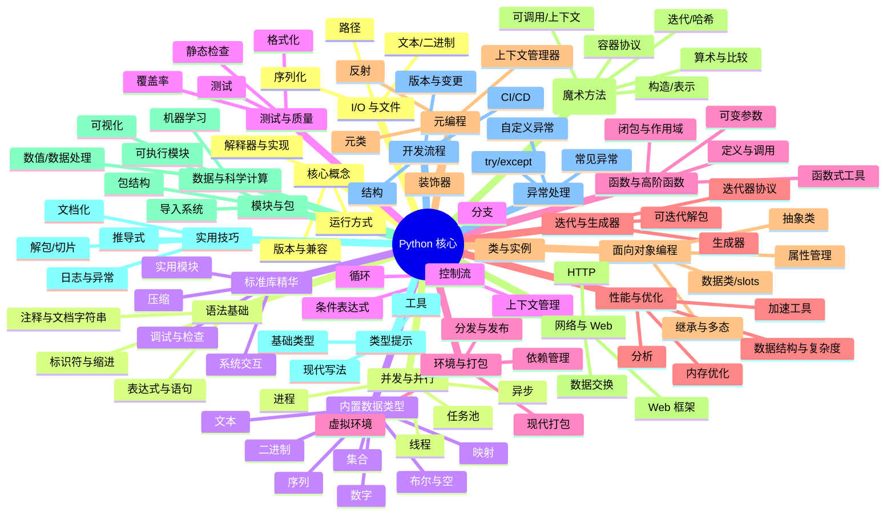

# Python 核心思维导图（Markdown 结构）

- 核心概念
  - 解释器与实现：`CPython`、`PyPy`、`MicroPython`
  - 运行方式：脚本、模块`python -m`、REPL、Jupyter
  - 版本与兼容：`3.x`、虚拟环境、依赖锁定

- 语法基础
  - 标识符与缩进、`PEP 8` 样式
  - 表达式与语句：赋值、条件、循环、推导式
  - 注释与文档字符串：`#`、`"""docstring"""`

- 内置数据类型
  - 数字：`int`、`float`、`complex`、`decimal`、`fractions`
  - 布尔与空：`True`、`False`、`None`
  - 序列：`list`、`tuple`、`range`
  - 文本：`str`（编码、格式化：`f"{}"`、`format`）
  - 集合：`set`、`frozenset`
  - 映射：`dict`
  - 二进制：`bytes`、`bytearray`、`memoryview`

- 控制流
  - 分支：`if/elif/else`
  - 循环：`for`、`while`、`break/continue/else`
  - 条件表达式：`a if cond else b`
  - 上下文管理：`with`、自定义 `__enter__/__exit__`

- 函数与高阶函数
  - 定义与调用：`def`、位置/关键字/默认值/仅限关键字（`*`）
  - 可变参数：`*args`、`**kwargs`
  - 闭包与作用域：`LEGB`、`nonlocal`、`global`
  - 函数式工具：`map`、`filter`、`functools`（`partial`、`lru_cache`）、`itertools`

- 迭代协议与生成器
  - 迭代器协议：`__iter__`、`__next__`
  - 生成器：`yield`、生成器表达式
  - 可迭代解包：`*rest`、`**mapping`

- 面向对象编程（OOP）
  - 类与实例、`self`、属性与方法
  - 继承与多态、`super()`
  - 数据封装与属性管理：`@property`、描述符
  - 抽象类与接口：`abc.ABC`、`@abstractmethod`
  - 数据类与不可变：`dataclasses`、`slots`、`frozen=True`

- Python 数据模型（魔术方法）
  - 构造/表示：`__init__`、`__repr__`、`__str__`
  - 容器协议：`__len__`、`__getitem__`、`__setitem__`、`__contains__`
  - 可调用与上下文：`__call__`、`__enter__/__exit__`
  - 算术与比较：`__add__`…、`__eq__`、`__lt__`
  - 迭代：`__iter__`、`__next__`
  - 哈希：`__hash__`、相等性与不可变性

- 模块与包
  - 模块结构：顶层代码、`__name__ == "__main__"`
  - 包与命名空间包、`__init__.py`
  - 导入系统：相对/绝对导入、`sys.path`、`importlib`
  - 入口点与可执行模块：`python -m package.module`

- 类型提示与静态检查
  - 基础：`typing`（`List`、`Dict`、`Tuple`、`Set`、`Optional`、`Union`、`Literal`、`TypedDict`、`Protocol`）
  - 现代写法：内置泛型 `list[int]`、`dict[str, Any]`
  - 工具：`mypy`、`pyright`、`pydantic`、`dataclasses`

- 异常与错误处理
  - 抛出与捕获：`try/except/else/finally`、`raise`
  - 自定义异常层次
  - 常见异常：`ValueError`、`TypeError`、`KeyError`、`IOError`、`AssertionError`

- I/O 与文件系统
  - 文本/二进制 I/O：`open`、编码 `encoding="utf-8"`
  - 路径：`pathlib`、`os`、`shutil`
  - 序列化：`json`、`pickle`、`csv`、`yaml`（第三方）

- 并发与并行
  - 线程：`threading`、GIL 与 I/O 密集
  - 进程：`multiprocessing`、CPU 密集
  - 任务池：`concurrent.futures`（`ThreadPoolExecutor`、`ProcessPoolExecutor`）
  - 异步：`async/await`、`asyncio`、任务与事件循环

- 标准库精华
  - 实用模块：`collections`、`math`、`statistics`、`datetime`、`time`
  - 实用工具：`functools`、`itertools`、`operator`、`enum`
  - 调试与检查：`logging`、`traceback`、`pprint`、`inspect`
  - 系统交互：`subprocess`、`argparse`、`sys`、`platform`
  - 打包压缩：`zipfile`、`tarfile`

- 测试与质量
  - 测试：`unittest`、`pytest`、夹具与参数化
  - 覆盖率：`coverage`
  - 静态检查：`flake8`、`ruff`、`pylint`
  - 格式化：`black`、`isort`

- 环境、依赖与打包
  - 虚拟环境：`venv`、`virtualenv`、`conda`
  - 依赖管理：`pip`、`requirements.txt`、`pip-tools`、`pipx`
  - 现代打包：`pyproject.toml`（`setuptools`、`hatchling`、`poetry`、`pdm`）
  - 分发与发布：`wheel`、`sdist`、`twine`、`__version__`

- 性能与优化
  - 分析：`timeit`、`cProfile`、`line_profiler`
  - 数据结构选择与算法复杂度
  - C 扩展与加速：`Cython`、`numba`、`PyPy`
  - 内存：`sys.getsizeof`、生成器、惰性计算

- 元编程与高级话题
  - 装饰器：函数/类装饰器、参数化装饰器
  - 上下文管理器：`contextlib.contextmanager`
  - 元类：`type`、`__new__`、类创建流程
  - 反射与动态：`getattr`、`setattr`、`hasattr`、`__dict__`

- 网络与 Web 基础
  - HTTP 客户端：`requests`（第三方）、`http.client`
  - Web 框架：`Flask`、`FastAPI`、`Django`（生态概览）
  - 数据交换：`json`、`pydantic`、`marshmallow`

- 数据与科学计算（概览）
  - `numpy`、`pandas`、`matplotlib`、`polars`
  - 符号/机器学习：`scikit-learn`、`scipy`、`sympy`

- 实用技巧与最佳实践
  - 解包与序列赋值、切片、`zip`、`enumerate`
  - 推导式：`list/set/dict` 推导与条件
  - 日志优先于 `print`，异常要语义化
  - 最小可复现与单一职责、明确 API 边界
  - 文档化：`docstring`、`Sphinx`、`mkdocs`

- 常用开发流程
  - 项目结构：`src/` 布局、`tests/`、`pyproject.toml`
  - CI/CD：`pre-commit`、`pytest -q`、`ruff --fix`、`black`
  - 版本与变更：`semver`、`CHANGELOG`

## Mermaid 思维导图

